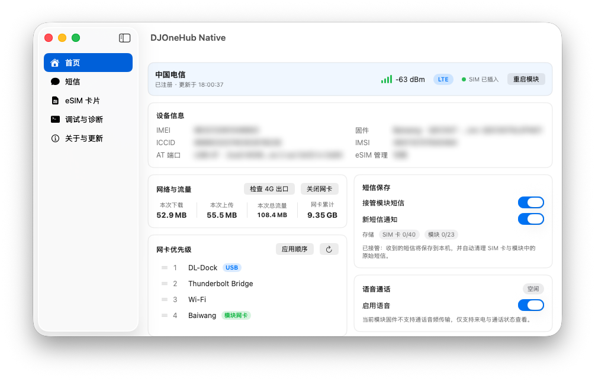

<p align="center">
  <picture>
    <source media="(prefers-color-scheme: dark)" srcset="docs/AppIcon-dark.png">
    
  </picture>
</p>

<h1 align="center">DJOneHub</h1>

<p align="center">
  <a href="LICENSE"></a>
  
  
  
  <a href="https://github.com/cr-zhichen/DJOneHubNative/releases"></a>
</p>

## 简介

DJOneHub（大疆第一代 4G 模块管理工具）的原生 macOS 重制版：SwiftUI 原生窗口界面 + Go 后端子进程，通过 Unix domain socket 通信，支持短信收发、eSIM Profile 管理、网络诊断与 AT 调试。

由 [ZenGeekLabs/DJOneHub](https://github.com/ZenGeekLabs/DJOneHub)（源自 [iniwex5/vohive](https://github.com/iniwex5/vohive)）改造而来：Web 套壳界面替换为原生 SwiftUI，后端 Go 逻辑保留自上游。

## 功能特性

- 首页总览：模块状态、设备信息、实时流量、网卡优先级、短信保存与语音通话状态
- 短信收发：会话列表 / 新短信系统通知 / 验证码标记 / 模块旧短信清理
- eSIM Profile 管理：卡片信息 / Profile 列表 / 下载 / 启用 / 改名 / 删除 / 号码资料
- 网络与流量：实时流量 / 网卡模式切换 / 4G 出口与代理检查 / 模块重启
- 应用分流：独立分流（应用级 4G 直连 / 系统直连 / 系统侧 SOCKS）与 Clash 代管（本地 4G SOCKS5 出口）
- 调试与诊断：网络诊断详情 / AT 指令调试 / 通知调试（分页组织）

## 界面预览

| 首页 | 关于与更新 |
| --- | --- |
|  |  |

## 接入准备

**硬件**

- 大疆第一代 4G 模块
- 可正常使用的实体 SIM，或与当前实现兼容的实体 eUICC/eSIM 卡片
- 支持数据传输的 USB-C 线缆
- Apple Silicon 或 Intel Mac

模块的 USB 设备标识通常为 `2ca3:4006`。连接后若 macOS 完全识别不到 USB 设备，请优先确认线缆支持数据传输。

**指示灯**

| 状态 | 常见含义 |
| --- | --- |
| 红色常亮 | 未插入 SIM 卡 |
| 红色闪烁 | SIM 卡未被正常识别 |
| 绿色常亮 | SIM 已识别，蜂窝信号通常较好 |
| 绿色闪烁 | SIM 已识别，蜂窝信号可能较弱或仍在注册 |

## 构建

```sh
mise install                # 按 mise.toml 安装固定版本的 Go（1.26.3）
mise run build              # 构建 .app（本机架构）
mise run build:universal    # 构建通用包（arm64 + x86_64）
mise run build:arm64 / build:x86_64
mise run launch             # 启动已构建的 app
mise run clean              # 清理 build/ 与 dist/
mise run backend:test / backend:vet / backend:tidy
```

需要：`mise`、Xcode（26 或更新）、`pkg-config`、`libusb`（brew）、`git` 与首次构建时可访问 GitHub 的网络。构建脚本会从固定提交编译独立的 sing-box 网络核心；发行版同时提供 universal / arm64 / x86_64 三种 DMG。

## 开发与测试环境

本软件目前的全部开发与测试均在 macOS 26 下完成。项目的最低部署目标仍为 macOS 13，但 macOS 13–25 尚未在真实设备上完成同等范围的验证。

当前主要开发设备：

| 项目 | 信息 |
| --- | --- |
| 设备 | MacBook Pro（Mac17,9） |
| 芯片 | Apple M5 Pro（15 核） |
| 内存 | 24 GB |
| 架构 | arm64 |
| 系统 | macOS 26.5.2（25F84） |
| Xcode | 26.6（17F113） |
| Go | 1.26.3（darwin/arm64） |

## 运行

```sh
open dist/DJOneHub-arm64.app
```

- 首页可选择开启/关闭后端服务，服务随 app 退出而停止
- 日志：`~/Library/Application Support/DJOneHubNative/djonehub.log`

### 首次启动（发行版）

发行版为 ad-hoc 签名（无公证），从 GitHub Releases 下载 **DMG**，双击挂载后将 App 拖入"应用程序"文件夹。首次启动时 macOS 可能提示"无法验证开发者"。如遇提示：

1. 尝试打开一次应用
2. 打开"系统设置"
3. 进入"隐私与安全性"
4. 点击"仍要打开"

之后即可正常使用。从源码本地构建（见上方"构建"）则不会触发该提示。

## 状态

- [x] 首页服务开关（开启 / 关闭 / 状态与错误提示）
- [x] 短信收发页（列表 / 刷新 / 发送 / 验证码标记 / 清空模块旧短信）
- [x] eSIM Profile 管理页（卡片信息 / Profile 列表 / 下载 / 启用 / 改名 / 删除 / 号码资料）
- [x] 网络与流量页（实时流量 / 模式切换 / 4G 出口与代理检查 / 诊断 / 重启模块）
- [x] AT 调试页（快捷命令 / 命令输入 / 响应历史）
- [x] 语音通话：来电自定义通知卡片（响铃 / 挂断 / 铃声选择 / 通话记录）
- [x] 分应用网络出口（独立分流 / Clash 代管，默认关闭）
- [x] 软件开机自启与后台运行
- [x] 菜单栏显示（默认仅图标，可选信号强度与实时上下行速率）

API 模型与端点已通过无硬件环境自动验证（`app/Tests/APIProbe`）；完整功能需接真机验证。

## 文档

- `docs/MODULE_RESEARCH.md`：大疆一代 4G 模块研究档案（硬件识别、USB ID 恢复手册、语音通话调查结论与 AT 指令清单）
- `docs/ARCHITECTURE.md`：项目架构与开发笔记（关键设计决策、踩坑记录）

## 许可证

继承自上游：PolyForm Noncommercial License 1.0.0（仅限非商业用途），必须保留上游声明 `Copyright iniwex5 (https://github.com/iniwex5/vohive)`。详见 LICENSE 与 THIRD_PARTY_NOTICES.md。

## 社区

本项目的开发契机源于 [LINUX DO](https://linux.do/) 社区。在社区中了解到大疆第一代 4G 模块后，萌生出在此基础上开展相关研究与 DJOneHub 的原生 macOS 重制工作。

作者社区主页：[zgccrui](https://linux.do/u/zgccrui)
